<div align="center">

# 🛒 Amazon vs Flipkart — Performance Analysis Project

### An End-to-End Data Analytics Pipeline: Python → SQL → Power BI


*A full-stack analytics project comparing Amazon and Flipkart across sales, logistics, and customer behavior — built with a real-world Python → SQL → BI pipeline.*

</div>

---

## 📋 Table of Contents

- [Overview](#-overview)
- [Tech Stack](#-tech-stack)
- [Project Architecture](#-project-architecture)
- [Dataset](#-dataset)
- [Step 1 — Data Cleaning & Preprocessing (Python)](#-step-1--data-cleaning--preprocessing-python)
- [Step 2 — Database Design & SQL Analysis (MySQL)](#-step-2--database-design--sql-analysis-mysql)
- [Step 3 — Power BI Dashboards](#-step-3--power-bi-dashboards)
- [Key Business Insights](#-key-business-insights)
- [Repository Structure](#-repository-structure)
- [Author](#-author)

---

## 🔎 Overview

This project simulates a **real-world e-commerce analytics engagement**, comparing **Amazon** and **Flipkart** on sales performance, logistics/delivery efficiency, and customer satisfaction using synthetic but realistic transactional data.

The goal was to build a project that mirrors an actual industry pipeline — not just a single notebook or a single dashboard — by taking data through three distinct stages of a modern analytics stack:

1. **Python (Pandas/NumPy)** — ingest, clean, and standardize raw Excel data from both platforms
2. **SQL (MySQL)** — model the cleaned data relationally and answer 14 real business questions using joins, CTEs, and window functions
3. **Power BI** — turn the SQL-driven insights into an interactive, multi-page executive dashboard

---

## 🛠 Tech Stack

| Layer | Tools Used |
|---|---|
| **Data Cleaning & Wrangling** | Python, Pandas, NumPy, Jupyter Notebook |
| **Database & Analysis** | MySQL, SQLAlchemy, PyMySQL |
| **Visualization** | Power BI |
| **Data Source** | Excel workbooks (`.xlsx`) — Amazon & Flipkart sales databases |

---

## 🏗 Project Architecture

The project follows a clean, linear **Excel → Python → MySQL → Power BI** pipeline:

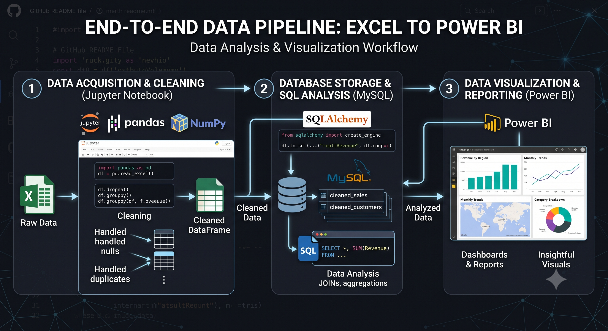

1. **Raw Data** — Two separate Excel workbooks (Amazon & Flipkart), each with 7 sheets
2. **Cleaning (Jupyter/Pandas)** — nulls handled, duplicates removed, platform tagged, datasets merged
3. **Storage (MySQL)** — cleaned data pushed into a relational schema via SQLAlchemy
4. **Analysis (SQL)** — 14 business questions solved using joins, CTEs, and window functions
5. **Visualization (Power BI)** — 3-page interactive dashboard for executives, ops, and customer teams

---

## 🗂 Dataset

Each platform's Excel workbook contains **7 relational sheets**:

| Table | Amazon Rows | Flipkart Rows |
|---|---|---|
| Customers | 12,000 | 12,000 |
| Products | 2,500 | 2,500 |
| Categories | 500 | 500 |
| Orders | 18,000 | 18,000 |
| Order_Items | 25,000 | 25,000 |
| Payments | 18,000 | 18,000 |
| Reviews | 5,958 | 5,986 |

After cleaning and merging both platforms into a single "platform-tagged" dataset, the combined data spans **~36,000 orders**, **~50,000 order items**, and **~11,400 reviews**.

---

## 🐍 Step 1 — Data Cleaning & Preprocessing (Python)

Using **Pandas** inside Jupyter Notebook, both Excel workbooks were loaded sheet-by-sheet, inspected, and cleaned independently before being merged into a unified dataset.

**Loading and inspecting each platform's sheets:**

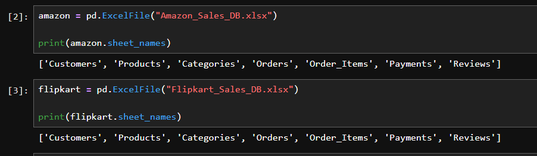

**Reading all 7 Amazon sheets into DataFrames and checking shapes:**

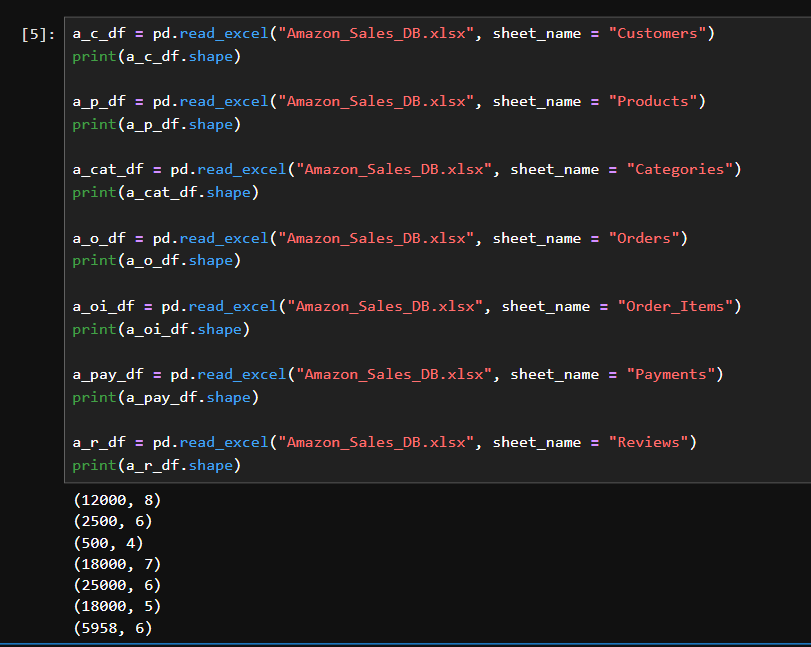

**Reading all 7 Flipkart sheets into DataFrames and checking shapes:**

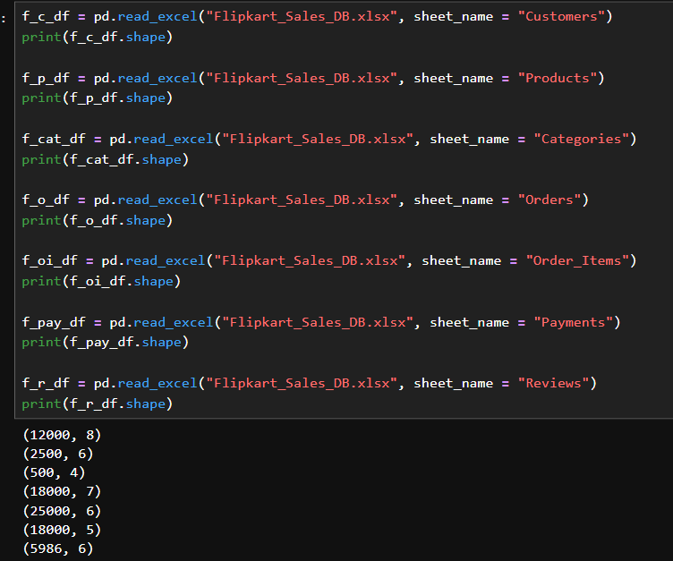

**Cleaning steps applied to every table:**
- ✅ Checked data types and structure with `.info()` and `.dtypes`
- ✅ Identified and removed duplicate rows
- ✅ Handled missing values (e.g., dropped rows with null `city` in Customers, null `rating` in Reviews)
- ✅ Tagged each row with its source `platform` (`Amazon` / `Flipkart`)
- ✅ Concatenated Amazon + Flipkart tables into unified, combined DataFrames
- ✅ Exported cleaned tables to CSV for backup/reproducibility

**Pushing the cleaned, merged data into MySQL using SQLAlchemy:**

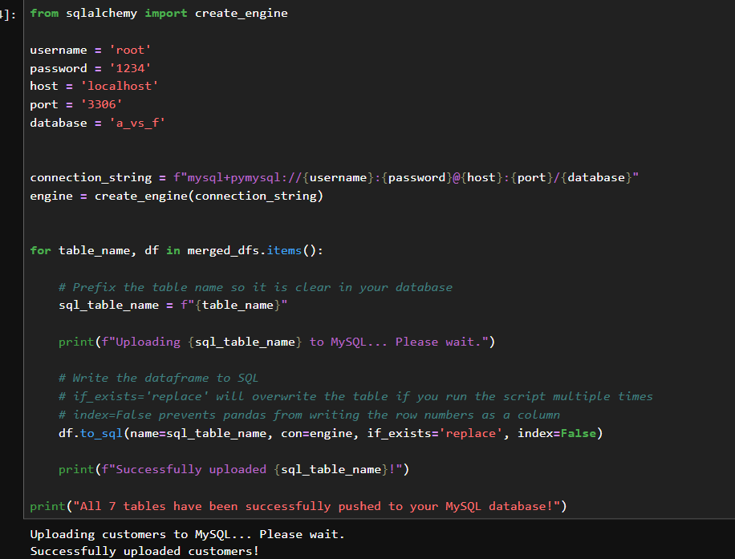

---

## 🗄 Step 2 — Database Design & SQL Analysis (MySQL)

Once loaded into MySQL (database: `a_vs_f`), indexes were added on all primary/foreign key columns and platform/status filters to keep queries performant at scale. From there, **14 business questions** were answered using SQL — ranging from simple aggregations to CTEs and window functions (running totals, `LAG()`, `ROW_NUMBER()`).

<details>
<summary><strong>📌 Full list of business questions solved</strong></summary>

1. Total sales volume and revenue comparison between platforms
2. City-wise concentration of registered customers per platform
3. Most preferred payment methods per platform
4. Low-stock products (< 50 units) needing restock
5. Realized revenue & AOV for delivered orders only
6. Top 3 revenue-driving categories per platform
7. Average delivery delay (in days) for late orders
8. Revenue lost due to cancelled orders
9. Product quality/satisfaction by category (ratings + reviews)
10. Monthly sales trend & MoM growth rate (window functions)
11. Repeat vs. single-time buyer segmentation & LTV
12. Impact of delivery delays on customer ratings
13. Pareto (80/20) analysis of Amazon's top revenue-driving products
14. Category co-purchase analysis (frequently bought together)

</details>

### Example: Top-line Revenue Comparison

```sql
select platform,
count(order_id) AS Total_Orders, round(sum(total_amount), 2) AS Total_Revenue_INR
from orders
group by platform
order by Total_Revenue_INR desc;
```

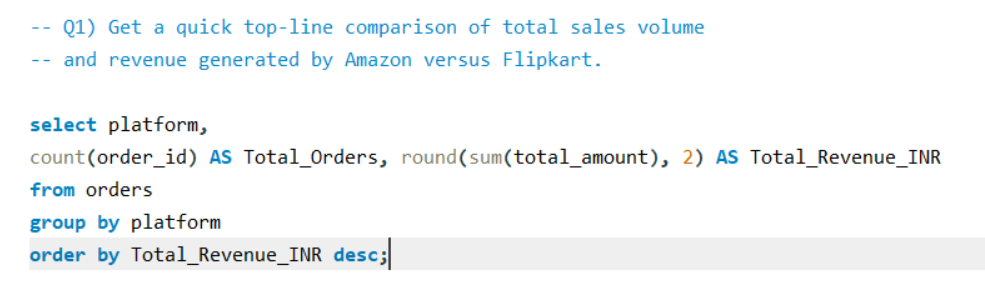
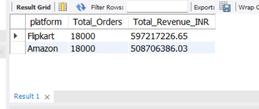

### Example: Top 3 Revenue Categories per Platform (Window Functions)

```sql
select platform, category_name, total_category_revenue
from (select o.platform, cat.category_name,
      round(sum(oi.total_price), 2) as Total_Category_Revenue,
      row_number() over (partition by o.platform order by sum(oi.total_price) desc) as category_rank
      from order_items oi
      join products p on oi.product_id = p.product_id
      join categories cat on p.category_id = cat.category_id
      join orders o on oi.order_id = o.order_id
      group by o.platform, cat.category_name
) ranked_categories
where category_rank <= 3;
```

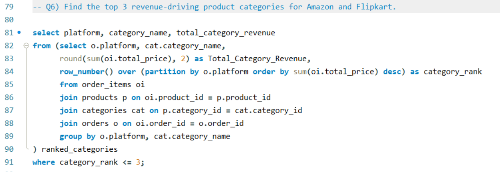
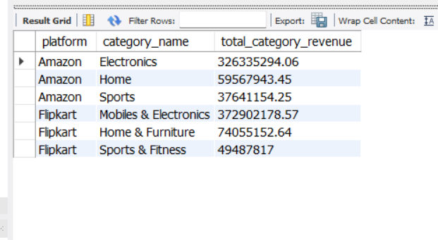

### Example: Product Quality by Category (Joins + Aggregation)

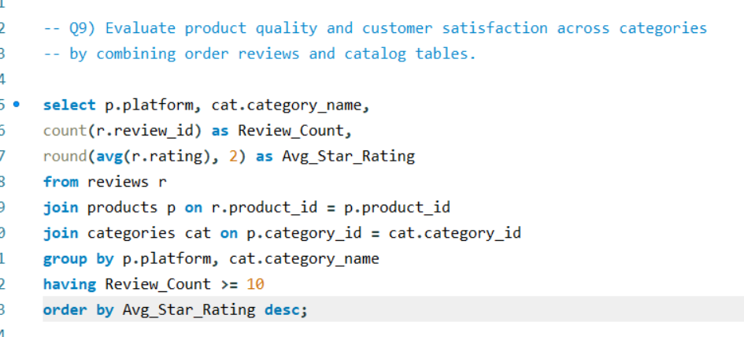
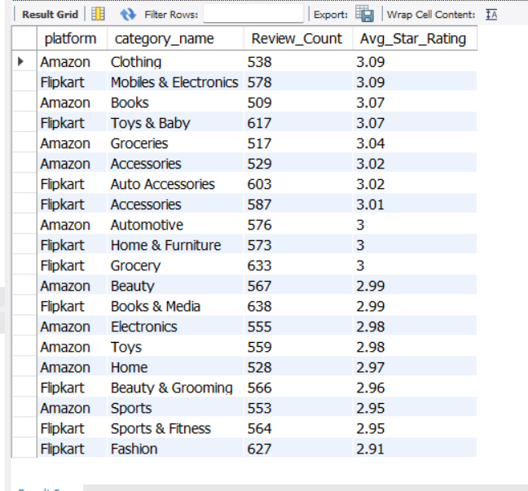

### Example: Monthly Sales Trend & MoM Growth (CTE + LAG Window Function)

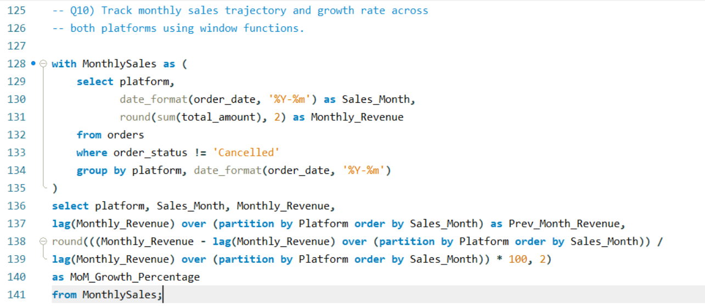

**Amazon monthly trend:**

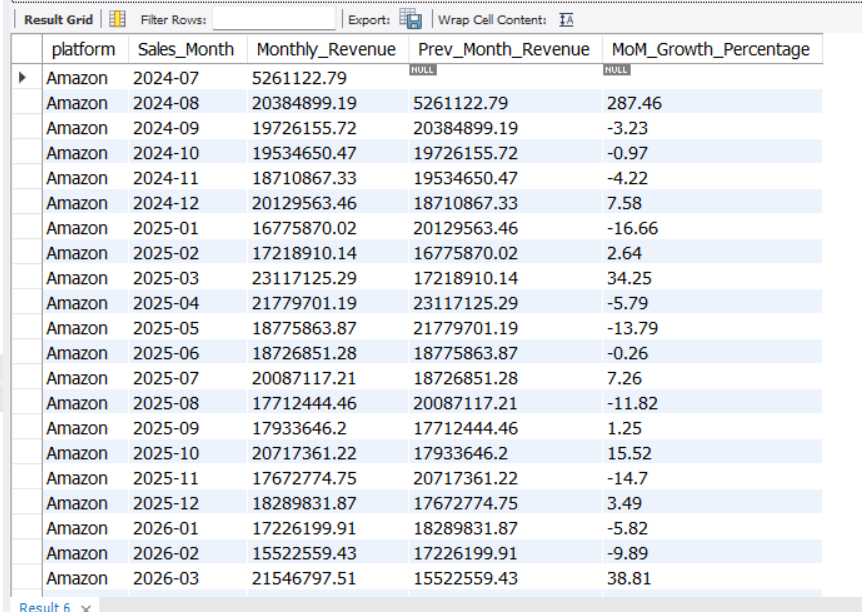

**Flipkart monthly trend:**

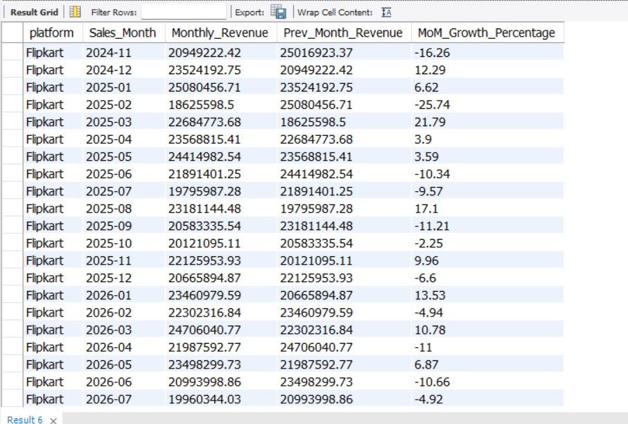

> 📄 The full SQL script with all 14 queries and index definitions is available in [`Amazon_vs_Flipkart_Project.sql`](./Amazon_vs_Flipkart_Project.sql).

---

## 📊 Step 3 — Power BI Dashboards

The SQL-analyzed data was connected to **Power BI** to build a 3-page interactive dashboard with cross-filtering by City, Platform, Year, and Month.

### 1️⃣ Executive Sales Overview

High-level KPIs (Total Revenue, Total Orders, AOV, Active Customers), revenue/order trends over time, platform-wise revenue split, and top revenue-driving products.

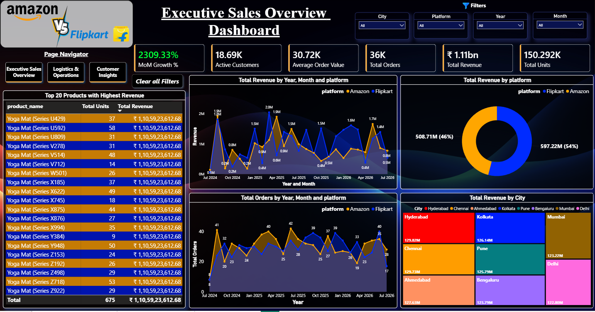

### 2️⃣ Logistics & Operations

Delivery performance, on-time %, cancellation trends, delayed orders and lost revenue by category, and delivery times by city.

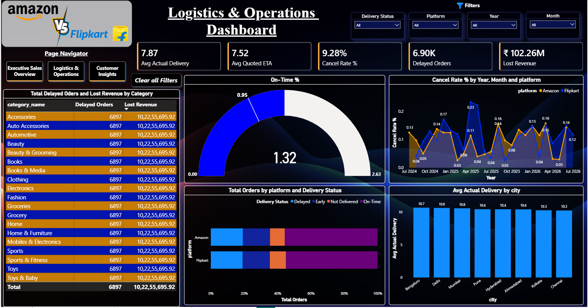

### 3️⃣ Customer Insights

Customer lifetime value, review/rating analysis, repeat vs. one-time buyer split, and top customers by revenue.

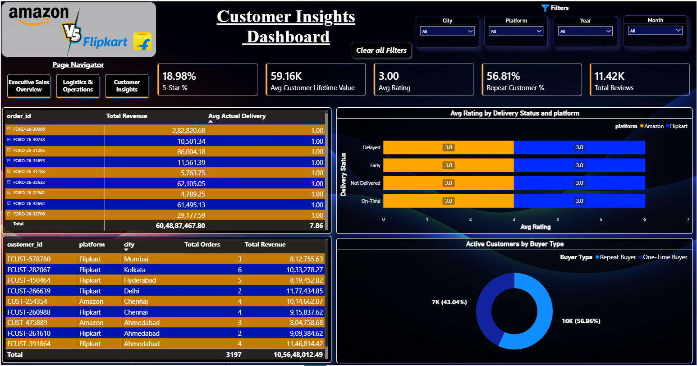

> 📄 The full interactive report file is available in [`Amazon_Vs_Flipkart_Project.pbix`](./Amazon_Vs_Flipkart_Project(Dashboard).pbix).

---

## 💡 Key Business Insights

- **Revenue split:** Flipkart edges out Amazon in total revenue — **₹59.7Cr (54%)** vs **₹50.9Cr (46%)** — despite both platforms recording an identical **18,000 orders** each.
- **Category leaders:** *Electronics* is the top-revenue category for Amazon (₹32.6Cr), while *Mobiles & Electronics* leads for Flipkart (₹37.3Cr) — both platforms' single strongest category.
- **Delivery performance:** Overall on-time delivery rate sits at **~95%**, with **6.9K delayed orders** translating to roughly **₹10.2Cr in lost revenue** from cancellations.
- **Customer loyalty:** **56.8%** of active customers are repeat buyers, and the average customer lifetime value stands at **~₹59.2K**.
- **Satisfaction:** Average rating across both platforms is a consistent **3.0 / 5**, regardless of whether delivery was on-time, early, or delayed — suggesting rating behavior is not strongly delivery-driven in this dataset.
- **Cancellations:** Blended cancellation rate across the two platforms is **~9.3%**.

---

## 📁 Repository Structure

```
Amazon-vs-Flipkart-Performance-Project/
│
├── images/                              # All screenshots used in this README
│   ├── Workflow_image.png
│   └── Screenshot_2026-09-14_*.png
│
├── Amazon_Sales_DB.xlsx                 # Raw Amazon dataset (7 sheets)
├── Flipkart_Sales_DB.xlsx               # Raw Flipkart dataset (7 sheets)
├── Amazon_vs_FlipKart_Project.ipynb     # Python data cleaning & MySQL upload
├── Amazon_vs_Flipkart_Project.sql       # Schema indexing + 14 business-question queries
├── Amazon_Vs_Flipkart_Project.pbix      # Power BI dashboard (3 pages)
└── README.md
```


---

## 👤 Author

**Mayank Singh**
🔗 [GitHub Repository](https://github.com/mayanksingh2108/Amazon-vs-Flipkart-Performance-Project)

---

<div align="center">

⭐ If you found this project useful or interesting, consider giving it a star on GitHub!

</div>
